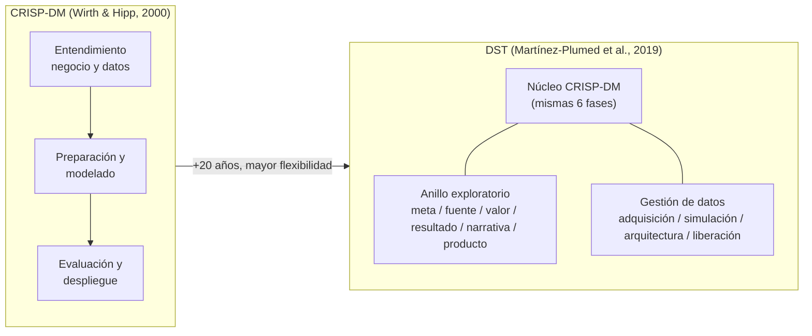
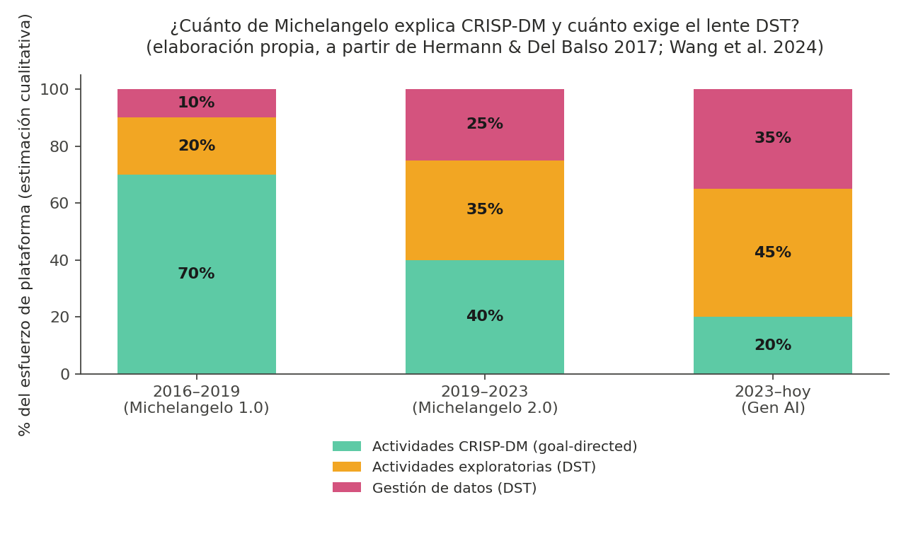
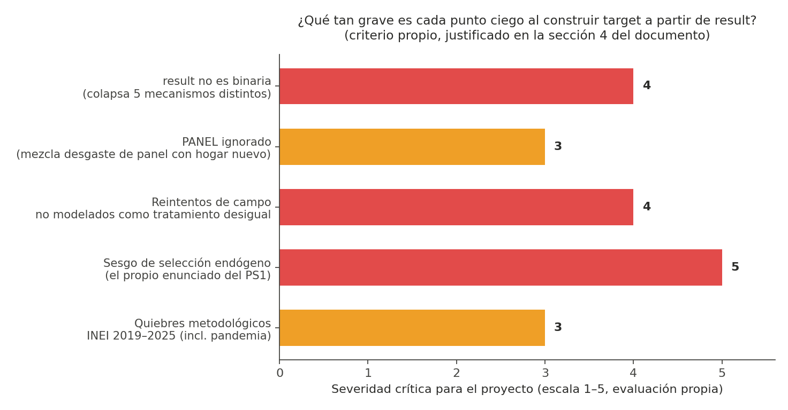

# Problem Set 1 — Parte 1
## CRISP-DM, sus límites y el caso Michelangelo (Uber)

**Curso:** Fundamentos de Ciencia de Datos
**Entrega:** 24 de agosto de 2026

---

## Resumen ejecutivo

CRISP-DM (Wirth & Hipp, 2000) continúa siendo el estándar de facto para estructurar proyectos de minería de datos; sin embargo, resulta necesario precisar el alcance real de esta afirmación. Se trata de un documento de once páginas, presentado en una conferencia orientada a aplicaciones prácticas —no en una revista arbitrada de primer nivel—, elaborado por dos autores pertenecientes a una sola empresa (DaimlerChrysler) y basado en la documentación de un único tipo de proyecto (modelos de respuesta de marketing). No constituye, por lo tanto, una validación científica del método en sentido estricto, sino un reporte de caso al que posteriormente se le atribuyó estatus de estándar universal. Esta circunstancia contribuye a explicar por qué, veinte años después, el modelo resultó insuficiente frente a la complejidad de la ciencia de datos contemporánea.

El trabajo de Martínez-Plumed et al. (2019) tampoco constituye el primer intento del mismo grupo de investigación por subsanar las limitaciones de CRISP-DM: dos años antes, varios de los mismos autores (Martínez-Plumed, Hernández-Orallo, Ferri) habían publicado la propuesta CASP-DM (2017), orientada a la reutilización de modelos y a la adaptación ante cambios de contexto, la cual no logró una adopción suficiente como para prescindir de una segunda propuesta —el marco DST— dos años más tarde. Esta circunstancia no invalida el argumento del artículo de 2019, pero sí sugiere que el cuestionamiento académico a los límites de CRISP-DM proviene, en una proporción considerable, de un mismo grupo de investigación de la Universitat Politècnica de València que ha insistido con distintas propuestas, y no de una convergencia independiente de todo el campo.

No obstante lo anterior, el argumento de fondo resulta sólido y encuentra respaldo empírico en el caso de Michelangelo, la plataforma de aprendizaje automático de Uber: su núcleo operativo (entrenamiento, evaluación y despliegue de modelos) se ajusta razonablemente bien a las fases de CRISP-DM, mientras que los desarrollos que impulsaron el crecimiento de dicha plataforma durante los últimos ocho años —el *feature store*, el sistema de priorización de proyectos y la infraestructura de *LLMOps*— exceden por completo el alcance de las seis fases originales del modelo de 2000. El presente documento cierra estableciendo un vínculo con el proyecto del curso: la predicción de la no respuesta en la ENAHO no constituye, en esencia, un problema de modelado, sino un problema de "entendimiento del negocio" insuficientemente especificado si no se revisa previamente la manera en que el INEI define y codifica la no respuesta en el trabajo de campo.

---

## 1. CRISP-DM según Wirth & Hipp (2000): aporte y limitaciones reconocidas por los propios autores

CRISP-DM organiza un proyecto de minería de datos en seis fases —Entendimiento del negocio, Entendimiento de los datos, Preparación de los datos, Modelado, Evaluación y Despliegue— estructuradas en una jerarquía de cuatro niveles (fases, tareas genéricas, tareas especializadas e instancias de proceso). La motivación declarada por los autores es de naturaleza económica: Wirth e Hipp (2000) sostienen que la estandarización del proceso reduce los costos de los proyectos de minería de datos y los vuelve "más confiables, repetibles, manejables y rápidos" (p. 1), en un contexto en el que la industria temía que los fracasos atribuibles a una gestión deficiente del proyecto fueran interpretados como fracasos de la tecnología en sí misma. Se trata, en esencia, de un argumento orientado a consolidar la categoría de mercado de la minería de datos mediante un lenguaje común de proceso.

Un aspecto insuficientemente citado en la literatura secundaria —dado que buena parte de las referencias al documento se limitan al diagrama de seis fases reproducido en la mayoría de los cursos— es que la sección 5 del artículo ("Lessons learned") constituye, en la práctica, un inventario de limitaciones del propio modelo, documentado por sus creadores:

- **La representación lineal contradice el mensaje textual del documento.** Si bien el texto reitera que las fases no siguen un orden estrictamente secuencial, los propios autores reconocen que la presentación gráfica "inevitablemente creó esa impresión" entre los responsables de la toma de decisiones, lo cual condujo en la práctica a la imposición de plazos rígidos y a la adopción de soluciones subóptimas. El diagrama ampliamente reproducido en la enseñanza de la metodología constituye, según sus propios creadores, parte del problema que ellos mismos identificaron.
- **La fase de preparación de datos resultó subestimada incluso por los propios autores.** Estos señalan textualmente que dicha fase "resultó ser mucho más costosa en tiempo y propensa a errores de lo que esperaban" (p. 9), pese a que ya anticipaban dificultades considerables. Si en el año 2000, trabajando con datos tabulares de marketing en un contexto europeo, la preparación de datos ya excedía los presupuestos previstos, corresponde cuestionar la viabilidad de aplicar un cronograma genérico equivalente a un panel de encuestas de hogares cuyos módulos se modifican cada dos o tres años, como ocurre con la ENAHO.
- **No se resolvió el criterio para determinar cuándo una tarea se considera concluida.** Los autores admiten explícitamente la ausencia de "un conjunto completo, satisfactorio y operacional de criterios" para dicho propósito.
- **El aseguramiento de calidad queda excluido del modelo**, al ser tratado como "un asunto de gestión común a todo tipo de proyectos" y no como un componente constitutivo del proceso de minería de datos. En consecuencia, CRISP-DM especifica qué actividades deben realizarse, pero no ofrece criterios para evaluar si dichas actividades se ejecutaron adecuadamente.

De lo anterior se desprende que CRISP-DM cumple una función efectiva como lenguaje compartido para la planificación y documentación de proyectos —circunstancia confirmada por más de dos décadas de adopción sostenida—, pero constituye, en su núcleo, una estructura desprovista de métricas de calidad y de criterios de cierre. Todo equipo que lo aplique sin desarrollar un modelo especializado propio —tal como los mismos autores recomiendan— corre el riesgo de reproducir exactamente las mismas dificultades documentadas en el año 2000.

## 2. La reformulación veinte años después: de los procesos de minería de datos a las trayectorias de ciencia de datos (Martínez-Plumed et al., 2019)

Martínez-Plumed et al. (2019) no proponen el abandono de CRISP-DM; sostienen que dicho modelo conserva plena validez cuando el proyecto es *goal-directed* y *process-driven*, es decir, cuando existe un objetivo de negocio claramente definido y los datos ya se encuentran disponibles. La analogía empleada por los autores resulta particularmente clarificadora: CRISP-DM equivale a la explotación de un yacimiento cuya existencia ya ha sido comprobada, mientras que una proporción considerable de la ciencia de datos contemporánea se asemeja más a la fase de prospección, en la que la ubicación del valor no se conoce de antemano y debe determinarse mediante un proceso exploratorio previo.

De esta distinción surge el modelo **DST (Data Science Trajectories)**, que conserva el núcleo de CRISP-DM y lo complementa con dos familias de actividades ausentes en el modelo original:

- **Actividades exploratorias:** exploración de metas, de fuentes de datos, del valor de los datos, de resultados, narrativa (comunicación de hallazgos mediante los datos) y de producto.
- **Actividades de gestión de datos:** adquisición, simulación, arquitectura y liberación de datos, relevantes en aquellos contextos en los que el dato constituye el producto final y no únicamente un insumo del proceso.

La comparación entre ambos modelos se resume en el diagrama presentado en la conversación asociada a este documento y, en formato reproducible para su visualización en GitHub, a continuación:

Uno de los argumentos centrales de los autores —y el de mayor pertinencia para el proyecto desarrollado en este curso— sostiene que la inferencia causal modifica el peso relativo de las fases del proceso: cuando el objetivo no se limita a predecir, sino que busca comprender relaciones contrafactuales ("qué ocurriría si"), la fase de entendimiento del negocio recupera protagonismo, pues constituye el momento en el que el conocimiento experto del dominio debe traducirse en preguntas y modelos concretos para las etapas subsiguientes (Martínez-Plumed et al., 2019, con referencia a Hernán et al., 2019). En otros términos, cuando un proyecto está destinado a sustentar una intervención —por ejemplo, decidir a qué hogares visitar con menor frecuencia—, no resulta suficiente que el modelo prediga con precisión; se requiere además comprender el mecanismo causal subyacente al dato, tarea que corresponde al conocimiento de dominio y no exclusivamente a la ingeniería de variables.

## 3. El caso Michelangelo: componentes explicados por CRISP-DM y componentes que requieren el marco de Martínez-Plumed

Corresponde señalar, como advertencia metodológica previa, que las publicaciones de 2017 y 2024 utilizadas como fuente constituyen entradas de blog corporativo de ingeniería, no artículos arbitrados ni auditorías externas. La publicación de 2017 emplea, por ejemplo, la expresión "as easy as requesting a ride" para describir Michelangelo, formulación que corresponde al registro discursivo del marketing corporativo antes que a una afirmación técnica verificable, en un momento en que Uber requería proyectar una imagen de solidez tecnológica en un contexto de presión regulatoria sobre su modelo de negocio. Las cifras reportadas (aproximadamente 400 proyectos activos, 20 000 entrenamientos mensuales, 5 000 modelos en producción) carecen de auditoría externa a la organización. El presente análisis emplea, no obstante, dicho caso por tratarse de la documentación más extensa y accesible disponible sobre una plataforma de esta naturaleza, si bien se lo trata como un estudio de caso ilustrativo y no como evidencia empírica concluyente.

A partir de esta precisión, se compara la versión inicial de la plataforma —Michelangelo 1.0, presentada en 2017— con su evolución hacia Michelangelo 2.0 y la incorporación de inteligencia artificial generativa, documentada en 2024.

*Nota.* Los porcentajes representados no constituyen datos oficiales publicados por Uber, sino una clasificación cualitativa elaborada a partir de los componentes descritos en ambas publicaciones para cada período (Palette, Gallery, Canvas, MA Studio, Gen AI Gateway, entre otros), agrupados según correspondan a una fase clásica de CRISP-DM o a una actividad exploratoria o de gestión de datos propia de DST. La tendencia identificada resulta consistente con la narrativa de las fuentes consultadas: durante el período 2016–2019, la mayor parte del esfuerzo documentado corresponde a un ciclo de entrenamiento, evaluación y despliegue (CRISP-DM en su forma más clásica); hacia 2023, la mayor proporción del esfuerzo descrito corresponde a actividades no contempladas por el modelo original.

| Componente de Michelangelo | Corresponde a una fase de CRISP-DM | Requiere el marco de DST |
|---|---|---|
| Entrenamiento, evaluación y despliegue de modelos de árboles/XGBoost para tiempo estimado de llegada, precios y riesgo (2016–2019) | Modelado, Evaluación, Despliegue: la presentación original de la plataforma la describe como orientada a "gestionar datos, entrenar, evaluar y desplegar modelos, y monitorear predicciones" (Hermann & Del Balso, 2017) | No aplica (proceso *goal-directed* clásico) |
| **Palette**, el *feature store* que hacia 2024 aloja más de 20 000 variables reutilizables entre equipos | Parcialmente, Preparación de datos | **Gestión de datos** (arquitectura): el dato deja de ser un insumo específico de un proyecto para constituirse en infraestructura compartida entre proyectos, dimensión que CRISP-DM no contempla al tratar el dato como un elemento estático dentro del proceso |
| **Gallery** (registro de modelos) y **MA Studio** (interfaz unificada del ciclo de vida) | Vinculación débil con Despliegue | **Exploración de producto**: el objetivo deja de ser un modelo individual para constituirse en una experiencia de desarrollo reutilizable por cientos de equipos |
| Decisión de invertir en aprendizaje profundo para mapas tridimensionales y percepción de vehículos autónomos previamente a la definición de un caso de negocio tabular claro | No existe una fase equivalente | **Exploración de metas** y **de fuentes de datos**: se explora el potencial de nuevas fuentes (sensores, imágenes) antes de establecer el objetivo de negocio |
| **Model Excellence Score** y el sistema de priorización de proyectos (2019–2023), orientado a asignar recursos según el impacto de negocio | Vinculación parcial con Evaluación, a nivel de portafolio y no de un modelo individual | Gestión del portafolio de proyectos de ciencia de datos, dimensión ajena al alcance de CRISP-DM |
| **Gen AI Gateway** y el catálogo de modelos de lenguaje (2023 en adelante): acceso unificado a modelos externos e internos, con controles de costo, seguridad y datos personales | No existe una fase equivalente clara | **Exploración de producto** y **de valor de los datos**: previamente al modelado, resulta necesario determinar la conveniencia de emplear un modelo de lenguaje de terceros, afinar uno propio, o combinar ambas alternativas según los datos propietarios disponibles |

La narrativa institucional de Uber, examinada con detenimiento, corrobora el diagnóstico de Martínez-Plumed et al., si bien no de manera intencional. La primera versión de Michelangelo se desarrolló para resolver un problema propio de CRISP-DM: antes de 2016, no existía infraestructura para entrenar modelos de mayor escala que la disponible en un equipo de cómputo individual, ni un repositorio estandarizado para los resultados experimentales (Hermann & Del Balso, 2017). Se trata de un problema de infraestructura circunscrito a la fase de Modelado. Sin embargo, conforme la plataforma alcanzó mayor madurez, el esfuerzo de desarrollo se orientó hacia actividades no contempladas por CRISP-DM: la construcción de un *feature store* compartido entre equipos, la definición de un sistema de priorización de proyectos según impacto de negocio y, más recientemente, la ampliación de la plataforma para cubrir el ciclo completo de *LLMOps* —preparación de datos de afinamiento, ingeniería de instrucciones (*prompts*), evaluación de modelos de lenguaje, despliegue y monitoreo (Wang et al., 2024). Ninguna de estas actividades cuenta con una fase correspondiente en el diagrama original de seis etapas; todas ellas corresponden al anillo exploratorio o a la gestión de datos propuestos por DST.

Un aspecto que suele omitirse en una lectura superficial de la publicación de 2024 es que los propios autores de Uber reconocen que, en diversos proyectos, "XGBoost supera al aprendizaje profundo tanto en desempeño como en costo" (Wang et al., 2024). Tras ocho años de inversión considerable en infraestructura de aprendizaje profundo, la conclusión reportada no consiste en recomendar sistemáticamente el modelo de mayor complejidad, sino en advertir en sentido contrario. Este tipo de autocrítica resulta poco frecuente en el material de divulgación corporativa y constituye un matiz relevante para demostrar una lectura completa de la fuente, más allá del resumen ejecutivo.

## 4. Vinculación con la realidad peruana: ENAHO, INEI y los límites del "entendimiento del negocio"

El ejercicio propuesto en este curso —predecir la no respuesta de los hogares en la ENAHO con el fin de que el INEI minimice el gasto asociado a las visitas de campo— constituye, en apariencia, un proyecto plenamente compatible con CRISP-DM: existe un objetivo de negocio definido (reducción del costo de campo), una variable objetivo a predecir (`result`) y una secuencia de fases razonable. No obstante, un análisis estadístico riguroso debe identificar al menos cinco aspectos que el modelo lineal de Wirth e Hipp no exige cuestionar, pero que el marco de Martínez-Plumed et al. sí exige incorporar.

1. **La variable `result` no constituye una variable binaria por naturaleza; dicha condición resulta de una decisión de modelado que requiere justificación explícita.** Según el diccionario de variables oficial del módulo 100 de la ENAHO (INEI, 2024), la variable `RESULT` presenta siete categorías, no dos: 1. Completa, 2. Incompleta, 3. Rechazo, 4. Ausente, 5. Vivienda desocupada, 6. No se inició la entrevista, 7. Otro. El enunciado del PS1 solicita construir la variable `target` como "no respuesta si la encuesta no es completa ni incompleta", lo cual implica agrupar cinco categorías con mecanismos generadores sustancialmente distintos (rechazo activo del informante, vivienda desocupada, ausencia temporal, o incidencias logísticas del encuestador) en una única clase. Esta agregación resulta estadísticamente relevante: un modelo que clasifica correctamente la clase agregada puede estar prediciendo, en la práctica, principalmente la categoría más frecuente (probablemente "ausente" o "vivienda desocupada" en zonas urbanas de alta rotación poblacional), con un desempeño deficiente en la categoría de rechazo —precisamente el mecanismo de mayor interés desde la perspectiva de política pública, dado que, a diferencia de una vivienda desocupada, el rechazo constituye una decisión del hogar.

2. **El diseño de la ENAHO incorpora un componente panel que resulta relevante para el análisis y que probablemente será omitido por la mayoría de los trabajos del curso.** El diccionario de variables incluye asimismo la variable `PANEL` ("¿el hogar fue entrevistado el año pasado?"). Dicha variable resulta pertinente porque la no respuesta en un hogar panel —previamente contactado— corresponde a un fenómeno distinto (desgaste de panel, fatiga del informante, cambio de residencia) del que afecta a un hogar nuevo sin contacto previo con el INEI. La estimación de un único modelo para ambas poblaciones, sin incorporar `PANEL` como variable de control, implica combinar dos poblaciones con mecanismos de no respuesta potencialmente distintos, lo cual introduce sesgo en los coeficientes estimados hacia el grupo de mayor tamaño muestral.

3. **El entendimiento del negocio no puede desvincularse del entendimiento del operativo de campo.** El Manual del Encuestador (INEI, 2024, Doc. ENAHO 08.01) no concibe la no respuesta como un evento aleatorio: el protocolo establece que, ante la ausencia del informante, el jefe de brigada debe verificar que el encuestador retorne a la vivienda "las veces necesarias" antes de registrarla como no respuesta, procedimiento que también se aplica en los casos de rechazo. Ello implica que el número de intentos de contacto —variable habitualmente ausente en las bases descargadas, al no figurar de manera directa en el módulo 100, sino de forma implícita en la logística de campo— constituye, en rigor, una variable de tratamiento que el propio INEI aplica de manera diferenciada según el costo de la zona. Considerar `result` como el resultado de un único intento de contacto, sin incorporar el efecto de los reintentos diferenciados, constituye una simplificación que ninguna fase de CRISP-DM exige cuestionar, pero que el enfoque de inferencia causal propuesto por Martínez-Plumed et al. sí requiere examinar antes de iniciar la fase de preparación de datos.

4. **El propio enunciado del PS1 describe un mecanismo de sesgo de selección endógeno.** Se indica que los encuestadores han omitido de la muestra a unidades de mayor costo de entrevista, lo cual sesga las estadísticas oficiales derivadas. Desde la perspectiva de Hernán et al. (2019), referenciados por Martínez-Plumed et al. (2019), esta circunstancia transforma el ejercicio en algo que excede una tarea de predicción: si el objetivo final consiste en emplear el modelo para decidir a qué hogares visitar, se está interviniendo sobre el mecanismo que generó los propios datos de entrenamiento. Un modelo entrenado sobre datos con no respuesta ya sesgada por costo puede retroalimentar dicho sesgo: las unidades de mayor costo de visita presentarán una probabilidad predicha más alta de no respuesta, lo cual reducirá aún más la frecuencia de sus visitas y perpetuará su subrepresentación en las estadísticas oficiales de pobreza y empleo. Se trata precisamente del tipo de problema que, según los autores, exige incorporar la "exploración de metas" como componente explícito del proyecto, en lugar de asumirla como un aspecto resuelto de antemano.

5. **La variabilidad metodológica del INEI entre 2019 y 2025** —modificaciones en la definición de dominios, actualización de estratos, digitalización del cuestionario, así como las pausas y ajustes muestrales derivados de la pandemia— implica que la agregación de la no respuesta por año, sin controlar por dichos cambios metodológicos, puede confundir una tendencia sustantiva con un cambio de instrumento de medición. Se trata de un riesgo característico de las series administrativas peruanas, documentado con menor frecuencia que otros aspectos de la metodología ENAHO, pese a que las fichas técnicas ofrecen suficiente información para su identificación.

*Nota.* La escala de severidad (1 a 5) corresponde a un juicio de valor fundamentado en el análisis precedente y no a un estadístico calculado sobre datos, dado que la fase de pipeline correspondiente a la Parte 2 de este trabajo aún no se ha ejecutado. El sesgo de selección endógeno (punto 4) recibe la calificación más alta debido a que constituye el único de los cinco aspectos identificados capaz de invalidar la interpretación causal del modelo en su totalidad, y no únicamente de reducir su precisión: si el mecanismo de no respuesta ya se encuentra correlacionado con el costo de la visita, cualquier modelo entrenado sobre dichos datos hereda ese sesgo en su función objetivo. En cambio, omitir la variable `PANEL` (punto 2) o los quiebres metodológicos (punto 5) deteriora la calidad del modelo sin necesariamente invalidar su lógica de fondo, razón por la cual dichos aspectos reciben una calificación de 3.

## 5. Conclusiones

- CRISP-DM conserva utilidad como lenguaje común para la planificación y documentación de proyectos, si bien sus propios creadores advirtieron desde el año 2000 sus principales limitaciones: rigidez percibida en la aplicación práctica, subestimación sistemática de la fase de preparación de datos y ausencia de criterios explícitos de calidad y de cierre de tarea.
- Martínez-Plumed et al. (2019) no invalidan CRISP-DM; lo incorporan como un caso particular —el de mayor disciplina metodológica— dentro de un espacio más amplio de trayectorias posibles, pertinente en aquellos contextos en los que el dato constituye el producto y no únicamente el insumo del proceso.
- El caso Michelangelo evidencia empíricamente dicha transición: la plataforma se originó para resolver un problema característico de CRISP-DM (entrenamiento y despliegue reproducible de modelos) y actualmente destina una proporción creciente de su esfuerzo a actividades exploratorias y de gestión de datos —*feature stores*, priorización de proyectos, *LLMOps*— no anticipadas por el modelo de 2000.
- En relación con el proyecto de no respuesta en la ENAHO, la lección metodológica de mayor relevancia no corresponde al modelado, sino al diseño del proyecto: el "entendimiento del negocio", en el contexto de la estadística pública peruana, exige incorporar el protocolo de campo del INEI y considerar la posibilidad de sesgo de selección endógeno antes de iniciar la fase de preparación de datos.

## 6. Limitaciones

- **Limitaciones del presente análisis.** El documento constituye una lectura crítica de dos artículos metodológicos y de material de divulgación corporativa (publicaciones de blog técnico de Uber), y no una evaluación empírica independiente de la plataforma Michelangelo. No se dispuso de acceso a métricas internas de la organización más allá de la información publicada.
- **Limitaciones de la aplicación al contexto peruano.** (a) El INEI actualiza periódicamente la ficha técnica y los manuales de campo de la ENAHO, por lo cual las categorías exactas de no respuesta y sus definiciones pueden variar entre los distintos años comprendidos en la ventana 2019–2025 empleada en este problem set; (b) la disponibilidad de conectividad y de dispositivos para el levantamiento mediante cuestionario electrónico (CAPI) no resulta homogénea entre Lima Metropolitana, el resto de la costa, la sierra y la selva, circunstancia que puede introducir un mecanismo de no respuesta correlacionado con la dispersión geográfica y no exclusivamente con el costo mencionado en el enunciado; (c) la migración estacional y la informalidad laboral en el Perú dificultan la ubicación del jefe de hogar en el horario habitual de la visita, mecanismo de no respuesta distinto del rechazo activo que la variable `result` probablemente no distingue con la granularidad requerida; (d) todo modelo de no respuesta estimado con datos del período 2019–2025 incorpora el quiebre estructural asociado a la pandemia (2020–2021), el cual modificó tanto el protocolo de campo como los patrones de ausencia del hogar, y debe tratarse como una fuente de variación exógena y no como una señal predictiva estable.
- **Limitación de orden ético.** En caso de que el modelo resultante se emplee para determinar qué hogares reciben menor prioridad de visita, existe el riesgo de institucionalizar el sesgo de selección endógeno descrito en el propio enunciado del PS1, en lugar de corregirlo. Se trata de un riesgo que ninguna métrica de exactitud (*accuracy*) del modelo, considerada de manera aislada, permite detectar.

---

## Referencias

Hernán, M. A., Hsu, J., & Healy, B. (2019). A second chance to get causal inference right: A classification of data science tasks. *CHANCE, 32*(1), 42–49. https://doi.org/10.1080/09332480.2019.1579578

Instituto Nacional de Estadística e Informática. (2024). *Encuesta Nacional de Hogares (ENAHO) 2024 "Condiciones de vida y pobreza": Manual del encuestador* (Doc. ENAHO 08.01). https://proyectos.inei.gob.pe/iinei/srienaho/Descarga/DocumentosMetodologicos/2024-55/13_Manual_del_Encuestador.pdf

Instituto Nacional de Estadística e Informática. (2024). *Encuesta Nacional de Hogares (ENAHO) 2024: Diccionario de variables, módulo 100*. https://proyectos.inei.gob.pe/iinei/srienaho/Descarga/DocumentosMetodologicos/2024-55/20_Diccionario_2024.pdf

Martínez-Plumed, F., Contreras-Ochando, L., Ferri, C., Hernández-Orallo, J., Kull, M., Lachiche, N., Ramírez-Quintana, M. J., & Flach, P. (2021). CRISP-DM twenty years later: From data mining processes to data science trajectories. *IEEE Transactions on Knowledge and Data Engineering, 33*(8), 3048–3061. https://doi.org/10.1109/TKDE.2019.2962680

Uber Engineering (Hermann, J., & Del Balso, M.). (2017, 5 de septiembre). *Meet Michelangelo: Uber's machine learning platform*. Uber Blog. https://www.uber.com/en-IT/blog/michelangelo-machine-learning-platform/

Wang, K., Chen, E., Cai, M., & Wang, J. (2024, 2 de mayo). *From predictive to generative: How Michelangelo accelerates Uber's AI journey*. Uber Blog. https://www.uber.com/us/en/blog/from-predictive-to-generative-ai/

Wirth, R., & Hipp, J. (2000). CRISP-DM: Towards a standard process model for data mining. En *Proceedings of the Fourth International Conference on the Practical Application of Knowledge Discovery and Data Mining* (pp. 29–39).
