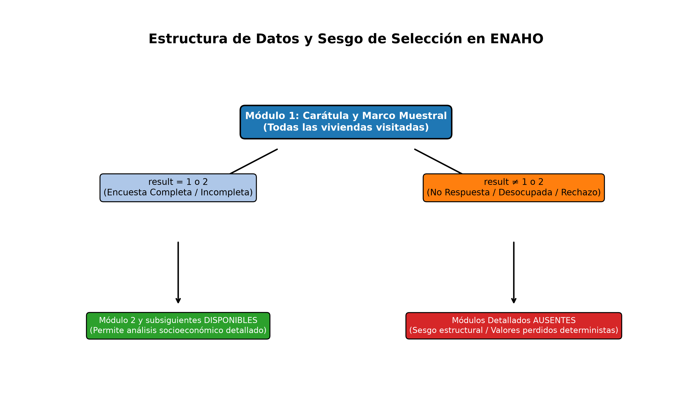

# Análisis Analítico y Metodológico: Entendimiento de Datos (Parte 2)

## 1. Tratamiento de Valores Faltantes en la Variable `result` y su Impacto Metodológico

### ¿Cómo altera esto nuestro problema?
Cuando una vivienda seleccionada en el marco muestral de la ENAHO arroja un resultado de no respuesta (vivienda desocupada, ausente o rechazo), el operativo de campo interrumpe la recolección, lo que genera una ausencia masiva y estructural de datos en los módulos subsiguientes. Metodológicamente, **esto altera radicalmente el problema**: no estamos ante un escenario de datos faltantes que puedan solucionarse mediante imputaciones estadísticas convencionales (como media o mediana) bajo supuestos *MCAR* o *MAR*. Nos enfrentamos a un **sesgo de selección determinista**, donde la ausencia de información es precisamente el fenómeno que deseamos predecir.

### ¿Cuáles son las variables que podemos utilizar?
Dado que los detalles internos del hogar no existen para las unidades no encuestadas, el modelo predictivo debe construirse estrictamente con las variables estructurales, geográficas y de control registradas en el **Módulo 1 (Carátula)** durante el primer contacto o visita de campo:
* **Ubigeo:** Departamento, provincia y distrito.
* **Estrato geográfico:** Indicador clave para diferenciar áreas urbanas y rurales.
* **Dominio geográfico:** Macroregiones estadísticas.
* **Variables de gestión de campo:** Mes, trimestre de ejecución de la encuesta y número de visitas registradas.

---

## 2. Evaluación de Utilidad del Módulo 2
* **¿Podemos utilizar el Módulo 2?**
  **No.** El Módulo 2 recopila información detallada sobre las características demográficas de los residentes del hogar. Puesto que las viviendas con "no respuesta" (desocupadas o con rechazo absoluto) impiden el ingreso del encuestador, **el Módulo 2 carece por completo de registros para estas unidades**. Utilizar este módulo provocaría la eliminación por completo (*listwise deletion*) de toda la población objetivo que el modelo busca anticipar, anulando la viabilidad del análisis predictivo.

---

## 3. Esquema Conceptual del Sesgo de Selección
Para visualizar de forma clara cómo interactúan los resultados del Módulo 1 con la disponibilidad de los módulos detallados subsiguientes, se presenta el siguiente diagrama esquemático:

